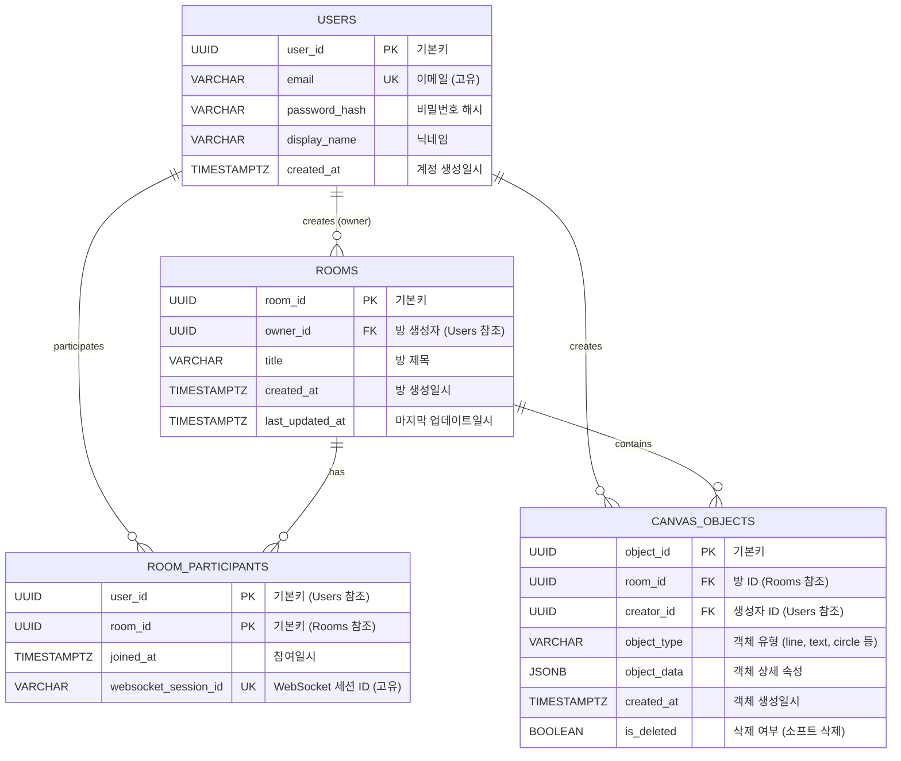

# CanvasSync Database ERD

## Entity Relationship Diagram

## 테이블 상세 정보

### 1. Users (사용자)
- **목적**: 회원가입한 사용자의 기본 정보 저장
- **주요 필드**:
  - `user_id`: UUID 타입의 고유 식별자
  - `email`: 로그인에 사용하는 이메일 (고유)
  - `password_hash`: 해시 처리된 비밀번호
  - `display_name`: 화면에 표시될 닉네임

### 2. Rooms (협업 캔버스 방)
- **목적**: 협업 세션(방)의 메타데이터 저장
- **주요 필드**:
  - `room_id`: 방의 고유 식별자 (URL에 사용)
  - `owner_id`: 방 생성자 ID (익명 방 허용 시 NULL 가능)
  - `title`: 방 제목
  - `last_updated_at`: 마지막 객체 수정/추가 일시 (오래된 방 정리용)

### 3. RoomParticipants (방 참여자)
- **목적**: 사용자와 방의 관계 맵핑, 현재 접속 상태 추적
- **복합 기본키**: (user_id, room_id)
- **주요 필드**:
  - `user_id`: 사용자 ID
  - `room_id`: 방 ID
  - `websocket_session_id`: 현재 연결된 WebSocket 세션 ID (연결이 끊기면 NULL)
- **제약조건**: 한 사용자가 한 방에 중복 참여 불가

### 4. CanvasObjects (캔버스 객체)
- **목적**: 캔버스에 그려진 개별 객체(선, 도형 등)의 데이터 저장
- **주요 필드**:
  - `object_id`: 객체의 고유 식별자
  - `room_id`: 이 객체가 속한 방 ID
  - `creator_id`: 이 객체를 그린 사용자 ID
  - `object_type`: 객체 유형 (예: "line", "text", "circle")
  - `object_data`: 객체의 상세 속성 (JSONB 타입)
  - `is_deleted`: 삭제 여부 (Undo/Redo를 위한 소프트 삭제)

## 관계 설명

1. **Users → Rooms (1:N)**
   - 한 사용자가 여러 방을 생성할 수 있음
   - `owner_id`가 Users를 참조

2. **Users ↔ Rooms (M:N via RoomParticipants)**
   - 한 사용자가 여러 방에 참여 가능
   - 한 방에 여러 사용자가 참여 가능
   - `RoomParticipants`가 중간 테이블 역할

3. **Users → CanvasObjects (1:N)**
   - 한 사용자가 여러 객체를 생성할 수 있음
   - `creator_id`가 Users를 참조

4. **Rooms → CanvasObjects (1:N)**
   - 한 방에 여러 객체가 존재할 수 있음
   - `room_id`가 Rooms를 참조

## 데이터 타입 요약

- **UUID**: 모든 기본키에 사용 (보안 및 분산 환경 대응)
- **TIMESTAMPTZ**: 타임스탬프 (시간대 정보 포함)
- **JSONB**: 캔버스 객체 데이터 (PostgreSQL JSONB 타입)
- **VARCHAR**: 문자열 데이터

